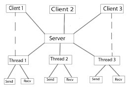
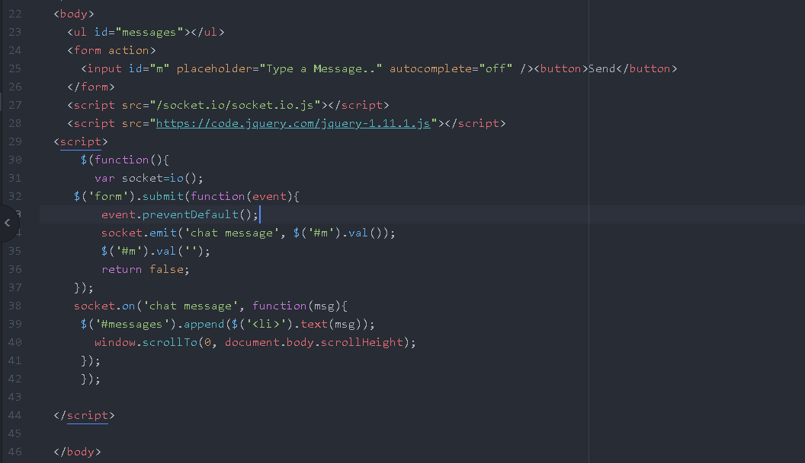
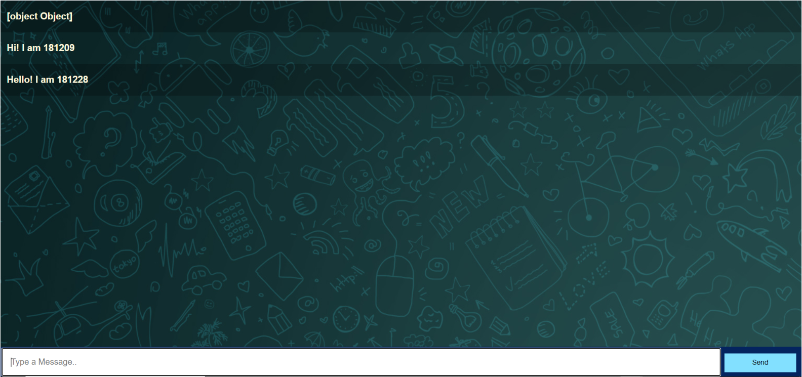
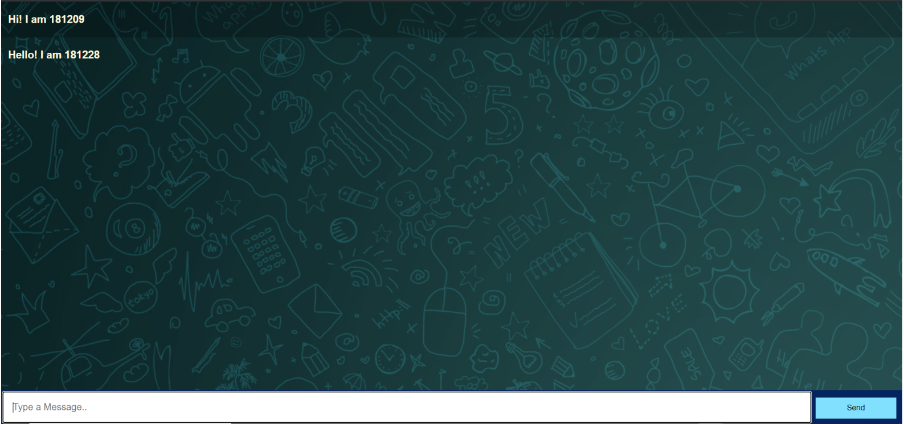
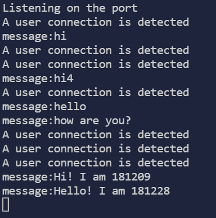

# Multi-Client-Chat-App

The latest development of the Internet has brought the world into our hands. Everything happens through the internet from passing information to purchasing something. The Internet made the world a small circle. This project is also based on the internet and it shows the importance of chat applications in day-to-day life and their impact on the technological world.
 
The project is a simple implementation of a simple client server chat system where once clients are connected to the server, then they can communicate with each other. In a multi-client chat server, N clients are connected to a server and send messages. 
**In this project, one of the clients sends messages to the server and it will send back the messages to all other clients. The client first needs to connect with the server and can then issue two commands - one will fetch the list of client's that are currently connected to the server and the other will send the message to that particular client number.**
 
Here is an overview of how we can entertain multiple client requests to a server in parallel. We are going to create a TCP/IP server that can receive multiple client requests at the same time and entertain each client request in parallel so that no client will have to wait for server time. The TCP/IP server has been designed with multi-threading for parallel processing and whenever a request comes to the server, the server’s main thread will create a thread and pass the client request to that thread with its ID. The thread will start processing with the client request, generate the report, and send it back to the client.
 

 
Above we have a layout for the model that we will be implementing in this project.
 
Socket programming is a way of connecting two nodes on a network to communicate with each other. One socket(node) listens on a particular port at an IP, while other socket reaches out to the other to form a connection. Server forms the listener socket while client reaches out to the server.
Socket.io enables real-time event-based communication between one or more clients and a server. It works on every platform, browser or device and is fast and reliable. Socket.io has two parts: a client-side library that runs in the browser, and a server-side library for Node.js. Both components have an identical API.
 
 

 

 

 

 

 

 

 
The project is yet to be deployed

